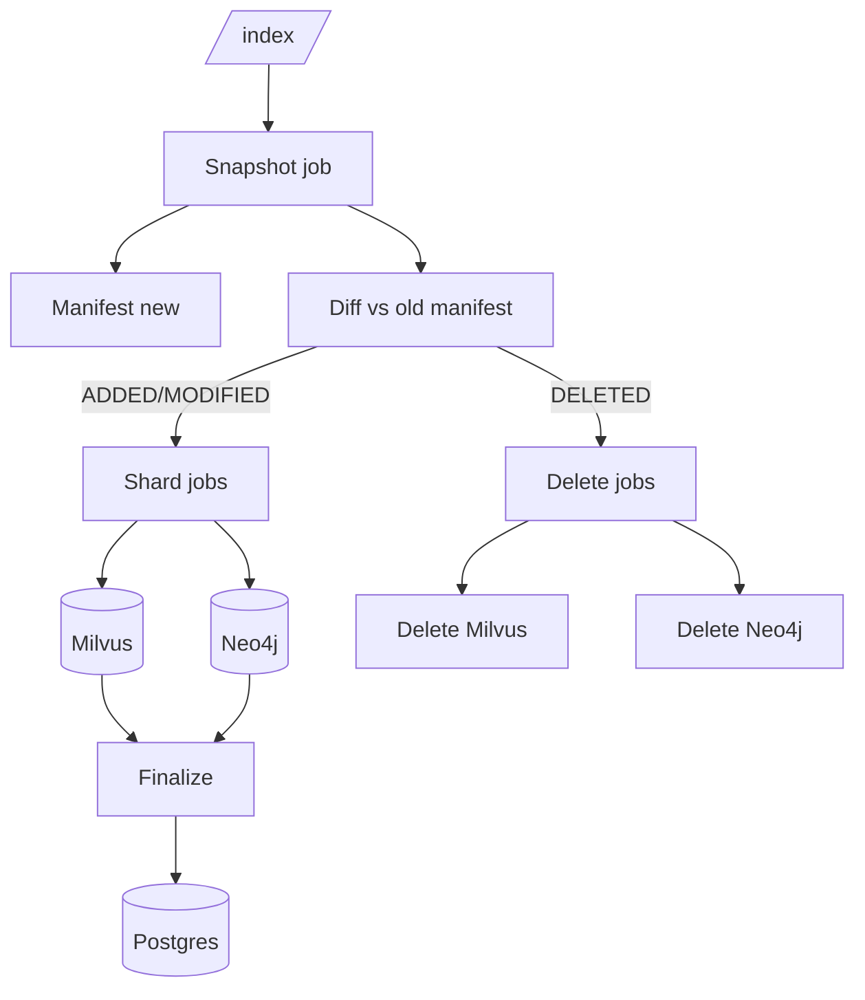
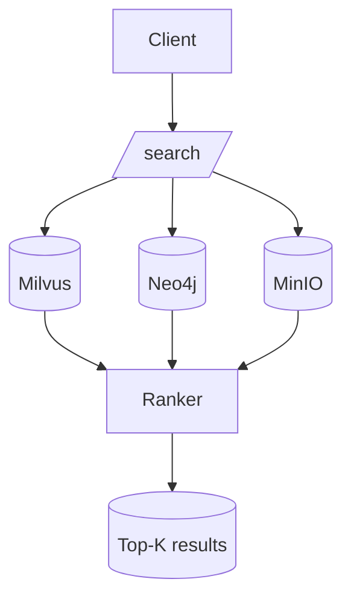
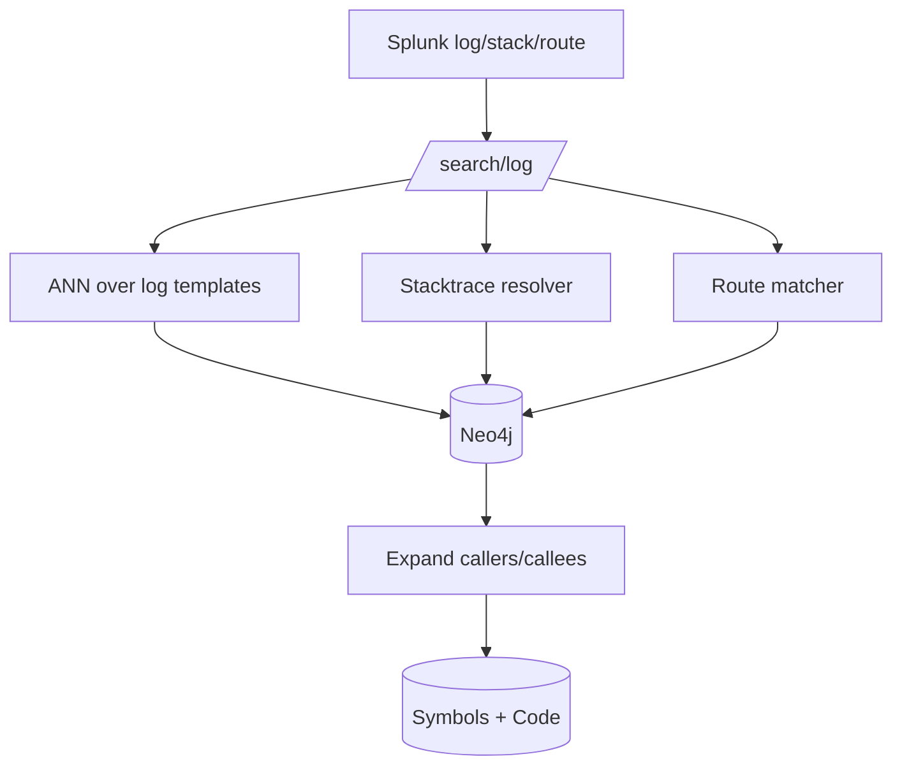

# Enterprise Code Indexing & Search (Multi-Tenant + Snapshot→MinIO + Incremental + Ops Add-on)

_Production-grade requirements for indexing, semantic+graph search, and ops troubleshooting with Splunk/stack traces._

Stack: **FastAPI + Postgres + Milvus + Neo4j + MinIO**

---

## 0) Tenancy Model
- Tenant key = `<domain>//<region>/<team>`
- Tokens stateless, provided in headers per request.

---

## 1) Branch Policy
- One branch per repo (default `main`/`master`).
- Track `last_indexed_commit` in Postgres per repo/branch.

```sql
ALTER TABLE repos
  ADD COLUMN branch TEXT NOT NULL DEFAULT 'main',
  ADD COLUMN last_indexed_commit TEXT;
```

---

## 2) Indexing — Snapshot → MinIO + Incremental
- **Snapshot job (locked)**:  
  - Fetch mirror, checkout commit, build manifest (`rel_path`, `sha256`, `size`, `lang`).  
  - Upload `snapshot.tar.zst` + `manifest.jsonl.zst` + shard lists.  
  - Diff with previous manifest → ADDED, MODIFIED, DELETED.  
  - Enqueue shards for ADDED+MODIFIED, deletes for DELETED.  
  - Update `last_indexed_commit`.

- **Shard jobs (parallel)**:  
  - Stream files from tar, chunk/embed → Milvus (stable IDs).  
  - Extract symbols/edges → Neo4j.  

- **Deletes**:  
  - Milvus: delete by `(tenant, project, branch, old_commit, rel_path)`  
  - Neo4j: detach delete nodes `(tenant, project, branch, rel_path)`.

- **Reindex** = force full rebuild (clear old data first).

---

## 3) Search API
- Inputs: query + repo URL(s) + tenant key + token.  
- Modes: `repo`, `list`, `my`, `region`.  
- Flow: validate tenant → resolve project_ids → recall vectors (Milvus partition) → expand with Neo4j graph → fetch from MinIO → fuse + rerank.  
- Return: top-K code chunks/methods + GitLab deep links.

---

## 4) Ops Troubleshooting Add-on

### Motivation
- Map Splunk logs, stack traces, or routes back to code.  
- Help ops/devs answer: *“Which method emitted this log? Where is this exception handled?”*

### Index-time
- Parse log templates (from common logging libs) → store normalized messages.  
- Embed templates and link to emitting symbol node in Neo4j with `:EMITS_LOG` edge.  
- Extract route → handler mappings (controllers, routers).  
- Store symbol metadata (fqns, line ranges) in Neo4j.

### Query-time
- `/search/log` accepts log line(s), stack trace, or route.  
- Pipeline:  
  - Normalize input log → ANN search over embedded templates.  
  - Parse stack trace → resolve frames to FQNs in Neo4j.  
  - Match route to handler symbol.  
  - Expand to callers/callees for blast radius.  
- Return: symbol(s), code spans, related methods, deep links.

### Example
```
POST /search/log
{
  "log": "Auth failed for user 123",
  "stack": "at JwtService.validate(...)",
  "route": "/api/v1/login"
}
```
Response: method/class symbols, code, graph neighbors, repo+file references.

---

## 5) Artifact Layout (MinIO)
```
s3://code-index/<tenant>/<project>/<commit>/
  ├─ snapshot.tar.zst
  ├─ manifest.jsonl.zst
  ├─ shards/shard-*.list.zst
  ├─ symbols.jsonl.zst
  └─ edges.jsonl.zst
```

---

## 6) System Diagrams

### Indexing (incremental)


### Searching (code queries)


### Ops log search


---

## 7) Acceptance Criteria
- One branch per repo.  
- `/index` = incremental; `/reindex` = full.  
- Tokens stateless.  
- Search returns methods/classes, expanded by graph.  
- Log/stack/route queries resolve to emitting code.  
- No shared FS: MinIO for artifacts.  
- Scales horizontally across workers.

