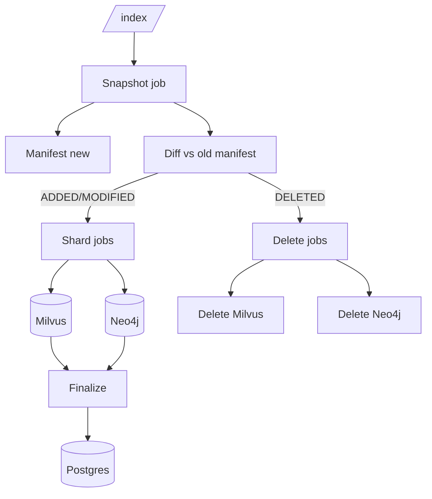

# Code Indexing Requirements (with Incremental Indexing)
_Target: single branch per repo, efficient incremental updates._

---

## Branch Policy
- Only index one branch (main/master).  
- Track `last_indexed_commit` in Postgres.  

```sql
ALTER TABLE repos
  ADD COLUMN branch TEXT NOT NULL DEFAULT 'main',
  ADD COLUMN last_indexed_commit TEXT;
```

---

## Flow

### Snapshot job
1. Fetch mirror, checkout commit.  
2. Build manifest (path, size, sha256, lang).  
3. Upload tar + manifest to MinIO.  
4. Compare manifest with last commit:  
   - ADDED, MODIFIED, DELETED.  
5. Enqueue shard jobs for ADDED+MODIFIED.  
6. Enqueue delete tasks for DELETED.  
7. Finalize by updating `last_indexed_commit`.

### Shard job
- Chunk/embed → Milvus (with stable IDs).  
- Merge symbols/edges → Neo4j.  
- IDs include `(tenant, project, branch, commit, rel_path, sha256, chunking_version)`.

### Delete
- Milvus delete vectors for `(tenant, project, branch, old_commit, rel_path)`.  
- Neo4j delete nodes for `(tenant, project, branch, rel_path)`.

---

## API

- `/index` → incremental by default.  
- `/reindex` → force full rebuild (clear old + reinsert).  
- Inputs remain simple (repo URL; token per request).

---

## Diagram



---

## Done Criteria
- Incremental indexing updates only changed files.  
- Reindex fully rebuilds.  
- Search always queries latest commit only.  
- Tokens stateless; no secrets stored.

