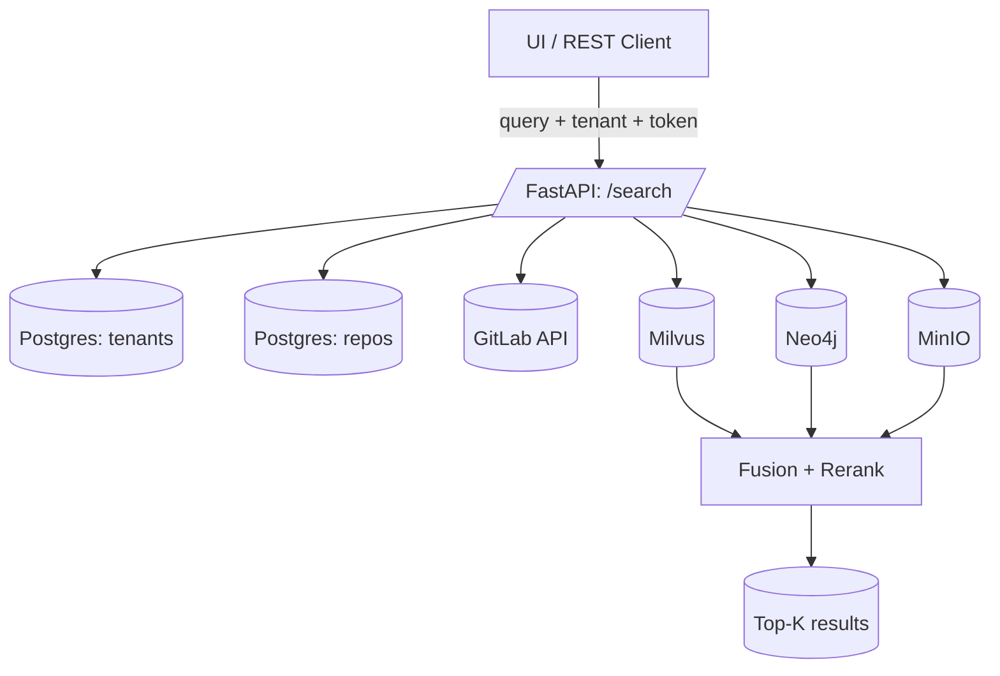

# Multi‑Tenant GitLab Code Indexing & Search (with Option B Snapshot → MinIO + Incremental Indexing)
**Requirements & Implementation Prompt (for GPT in VS Code)**  
_Target: simple to implement/maintain, but scalable. Uses stateless tokens (never stored)._

Stack: **FastAPI + Postgres (metadata) + Milvus (vectors) + Neo4j (graph) + MinIO (files)**

---

## 0) Tenancy Model

**Tenant = `<domain>//<region>/<team>`**  
Examples:
- `gitlab-scm.company.com//emea/teama`
- `gitlab-scm.company.com//emea/teamb`
- `gitlab-us.company.com//usa/teamx`

Requests carry tenant key and are always scoped.

---

## 1) Headers & Tokens

- `X-Tenant-Key: <domain>//<region>/<team or *>`
- `X-Git-Identity: domain=<domain>,token=<PAT>`

Stateless: tokens provided per request, never stored.

---

## 2) Postgres Schema

```sql
CREATE TABLE tenants (
  id UUID PRIMARY KEY,
  key TEXT UNIQUE NOT NULL,
  gitlab_domain TEXT NOT NULL,
  root_group_path TEXT NOT NULL,
  is_active BOOLEAN NOT NULL DEFAULT TRUE
);

CREATE TABLE repos (
  id BIGSERIAL PRIMARY KEY,
  tenant_id UUID NOT NULL,
  repo_url TEXT NOT NULL,
  project_id BIGINT,
  group_path TEXT,
  branch TEXT NOT NULL DEFAULT 'main',
  last_indexed_commit TEXT,
  is_index_enabled BOOLEAN NOT NULL DEFAULT TRUE,
  UNIQUE (tenant_id, repo_url, branch)
);
CREATE INDEX ON repos (tenant_id);
CREATE INDEX ON repos (project_id);
CREATE INDEX ON repos (tenant_id, project_id, branch);
```

---

## 3) Indexing — Snapshot → MinIO + Incremental

**Headers**
```
X-Tenant-Key: <domain>//<region>/<team>
X-Git-Identity: domain=<domain>,token=<PAT>
```

**Body**
```json
{
  "repo_url": "https://gitlab-scm.company.com/emea/teama/projects/service-a.git",
  "ref": "main",
  "mode": "incremental"
}
```

### Snapshot job (per-repo lock)
1. Fetch mirror and resolve commit.  
2. Create detached worktree at commit.  
3. Build `manifest.jsonl` with path, size, sha256, lang.  
4. Create `snapshot.tar.zst`; upload tar + manifest + shard lists to MinIO.  
5. Compute diff vs `last_indexed_commit`:  
   - ADDED (new files)  
   - MODIFIED (sha256 changed)  
   - DELETED (missing now)  
6. Enqueue shards for ADDED+MODIFIED; enqueue deletes for DELETED.  
7. Delete worktree; update `repos.last_indexed_commit`.

### Shard job (parallel)
- Download shard list and tar.  
- Stream each file, chunk/embed → Milvus (partition=tenant).  
- Extract symbols/edges → Neo4j.  
- Use **stable chunk IDs**:  
  ```
  sha1(tenant|project|branch|commit|rel_path|start|end|file_sha256|model|chunking_version)
  ```

### Delete handling
- Milvus: delete vectors matching `(tenant, project_id, branch, old_commit, rel_path)`.  
- Neo4j: `DETACH DELETE` nodes matching `(tenant, project_id, branch, rel_path)` for old commit.

### Reindex (force full)
- Clears all artifacts for repo+branch, then reindexes.  
- Triggered with `/reindex` or `/index?force_full=true`.

---

## 4) Searching

Same as before — query by repo URL(s), validate tenant, verify access with token, search Milvus (tenant partition), expand with Neo4j, fetch blobs from MinIO.

---

## 5) Artifact Layout (MinIO)

```
s3://code-index/<tenant_key>/<project_id>/<commit>/
  ├─ snapshot.tar.zst
  ├─ manifest.jsonl.zst
  ├─ shards/shard-0001.list.zst
  ├─ symbols.jsonl.zst (optional)
  └─ edges.jsonl.zst   (optional)
```

---

## 6) System Diagrams

### Indexing Flow (incremental)
```mermaid
flowchart TD
    Start[New /index request] --> Snapshot[Snapshot Job (locked)]
    Snapshot -->|Read last_indexed_commit| ReposDB[(Postgres: repos)]
    Snapshot -->|Create manifest.jsonl.zst| MinIO[(MinIO)]
    Snapshot --> Diff[Diff new vs prior manifest]
    Diff -->|ADDED/MODIFIED| Shards[Create shard lists]
    Diff -->|DELETED| Deletes[Plan deletes]

    Shards --> Queue[Shard Jobs]
    Queue --> Shard1[Shard #1 re-embed]
    Queue --> ShardN[Shard #N re-embed]

    Shard1 --> Milvus[(Milvus upserts)]
    Shard1 --> Neo4j[(Neo4j merges)]
    ShardN --> Milvus
    ShardN --> Neo4j

    Deletes --> Neo4jDel[Neo4j delete stale]
    Deletes --> MilvusDel[Milvus delete stale]

    Milvus --> Finalize[Finalize Job]
    Neo4j --> Finalize
    Finalize -->|set last_indexed_commit| ReposDB
```

### Searching Flow


---

## 7) Acceptance Criteria

- One branch per repo (default main).  
- `/index` = incremental update (only changed files).  
- `/reindex` = full rebuild.  
- Data in Milvus/Neo4j/MinIO always consistent with latest commit.  
- Tokens always stateless.  
- No shared filesystem — MinIO central artifact.

