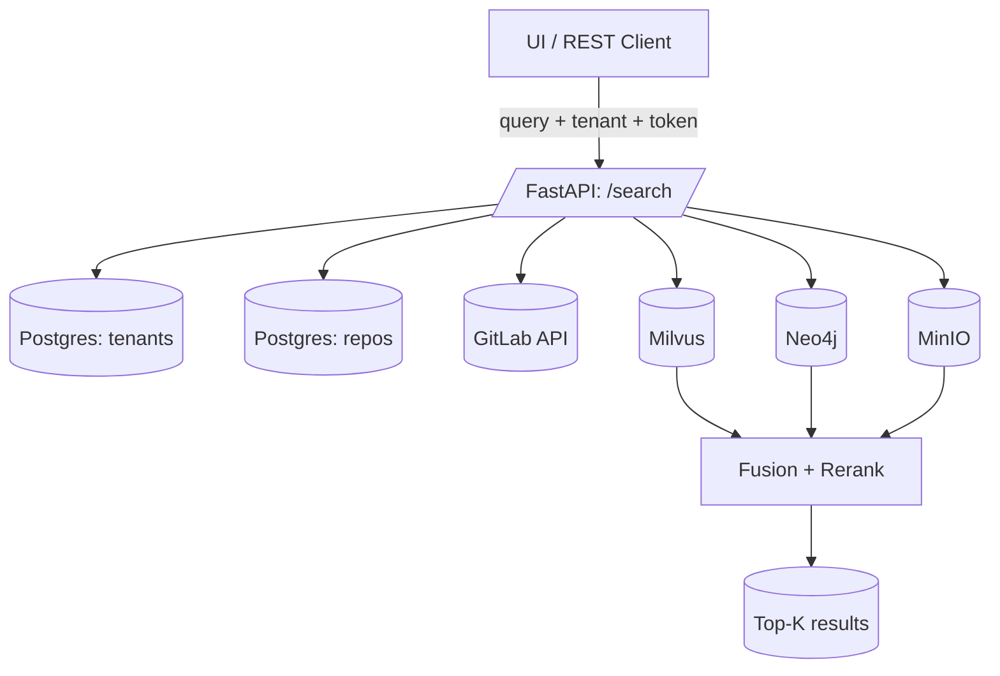

# Multi‑Tenant GitLab Code Indexing & Search (with Option B Snapshot → MinIO)
**Requirements & Implementation Prompt (for GPT in VS Code)**  
_Target: easy to implement/maintain, but scalable. Uses stateless tokens (never stored)._

Stack: **FastAPI + Postgres (metadata) + Milvus (vectors) + Neo4j (graph) + MinIO (files)**

---

## 0) Tenancy Model (clear & minimal)

**Tenant = `<domain>//<region>/<team>`**  
Examples:
- `gitlab-scm.company.com//emea/teama`
- `gitlab-scm.company.com//emea/teamb`
- `gitlab-us.company.com//usa/teamx`

All requests carry this tenant and are **scoped** to it.

---

## 1) Headers & Tokens (stateless)

- `X-Tenant-Key: <domain>//<region>/<team or *>`
  - `*` lets you search across **all teams** in that domain/region (e.g., `gitlab-scm.company.com//emea/*`).

- `X-Git-Identity: domain=<domain>,token=<PAT_or_OAuth>` (repeatable)
  - Used **only at request time** for GitLab API and/or `git fetch`.  
  - **Never stored.**

---

## 2) Minimal Postgres schema (control plane)

```sql
CREATE TABLE tenants (
  id UUID PRIMARY KEY,
  key TEXT UNIQUE NOT NULL,              -- domain//region/team  (or domain//region/*)
  gitlab_domain TEXT NOT NULL,
  root_group_path TEXT NOT NULL,         -- region/team or region/*
  is_active BOOLEAN NOT NULL DEFAULT TRUE
);

-- Repos you’ve seen (cache of URL→project_id mapping)
CREATE TABLE repos (
  id BIGSERIAL PRIMARY KEY,
  tenant_id UUID NOT NULL,
  repo_url TEXT NOT NULL,
  project_id BIGINT,                     -- GitLab project id (resolved once)
  group_path TEXT,                       -- region/team/subgroups
  last_indexed_commit TEXT,
  is_index_enabled BOOLEAN NOT NULL DEFAULT TRUE,
  UNIQUE (tenant_id, repo_url)
);
CREATE INDEX ON repos (tenant_id);
CREATE INDEX ON repos (project_id);
```

---

## 3) URL → Tenant parsing (helper)

```python
from urllib.parse import urlparse

def parse_repo_url(url_or_ssh: str):
    if url_or_ssh.startswith("git@"):
        url_or_ssh = url_or_ssh.replace("git@", "ssh://git@").replace(":", "/")
    u = urlparse(url_or_ssh)
    domain = (u.hostname or "").lower()
    parts = u.path.lstrip("/").removesuffix(".git").split("/")
    if len(parts) < 3:
        raise ValueError("Expect at least region/team/project in the path")
    region, team = parts[0], parts[1]
    root_group = f"{region}/{team}"
    group_path = "/".join(parts[:-1])  # region/team/... (no project)
    project = parts[-1]
    return domain, root_group, group_path, project
```

---

## 4) Indexing — Snapshot → MinIO (Option B)

**Headers**
```
X-Tenant-Key: <domain>//<region>/<team>
X-Git-Identity: domain=<domain>,token=<PAT_or_OAuth>
Content-Type: application/json
```

**Body**
```json
{
  "repo_url": "https://gitlab-scm.company.com/emea/teama/projects/service-a.git",
  "ref": "main",
  "mode": "incremental"
}
```

### A) Snapshot job (per‑repo lock)
1. Lock `(tenant_key, project_id)` (e.g., PG advisory lock).  
2. Update **mirror** (`git fetch --prune --tags --force`).  
3. Resolve **commit SHA** for the ref.  
4. Create **temporary worktree** (detached).  
5. Build **manifest.jsonl** (paths, size, sha256, lang).  
6. Create `snapshot.tar.zst`.  
7. Upload tar + manifest to MinIO.  
8. Create shard lists (e.g., 1000 files per shard).  
9. Upload shard lists under `shards/`.  
10. Delete worktree; unlock.  
11. Enqueue shard jobs `(tenant_key, project_id, commit, shard_id)`.

### B) Shard job (no lock)
- Download `shards/shard-XXXX.list.zst`.  
- Stream files from `snapshot.tar.zst`.  
- Chunk + embed → Milvus.  
- Extract symbols/edges → Neo4j.  
- Report status.

### C) Finalize job
- Verify all shards done.  
- Mark commit indexed in Postgres.  
- Optionally delete older commits’ artifacts in MinIO.

---

## 5) Searching — UI & REST

**Headers**
```
X-Tenant-Key: <domain>//<region>/<team or *>
X-Git-Identity: domain=<domain>,token=<PAT_or_OAuth>
Content-Type: application/json
```

**Body**
```json
{
  "query": "where is jwt validated?",
  "mode": "repo" | "list" | "my" | "region",
  "repo_url": "https://gitlab-scm.company.com/emea/teama/projects/service-a.git",
  "repo_urls": ["https://.../service-a.git","https://.../service-b.git"],
  "top_k": 5
}
```

**Flow**
1. Validate tenant.  
2. Resolve repo URLs → project_ids.  
3. Verify access with GitLab API (live, using token).  
4. Recall vectors from Milvus (tenant partition).  
5. Expand with Neo4j graph.  
6. Fetch blobs/manifest from MinIO.  
7. Fuse + rerank.  
8. Return top-K results.

---

## 6) MinIO artifact layout

```
s3://code-index/<tenant_key>/<project_id>/<commit>/
  ├─ snapshot.tar.zst
  ├─ manifest.jsonl.zst
  ├─ shards/shard-0001.list.zst
  ├─ shards/shard-0002.list.zst
  ├─ symbols.jsonl.zst (optional)
  └─ edges.jsonl.zst   (optional)
```

---

## 7) System Diagrams

### 📥 Indexing Flow (Option B)
```mermaid
flowchart TD
    UI[UI / REST / Webhook] -->|repo_url + tenant + token| API[/FastAPI: /index/]
    API -->|lock & fetch| SnapshotJob[Snapshot Job]
    SnapshotJob --> Git[Git Mirror (local)]
    SnapshotJob --> Tar[snapshot.tar.zst]
    SnapshotJob --> Manifest[manifest.jsonl.zst + shard lists]
    Tar --> MinIO[(MinIO)]
    Manifest --> MinIO
    SnapshotJob --> Queue[Shard Jobs]

    Queue --> Shard1[Shard Job #1]
    Queue --> ShardN[Shard Job #N]
    Shard1 --> MinIO
    ShardN --> MinIO

    Shard1 --> Milvus[(Milvus)]
    Shard1 --> Neo4j[(Neo4j)]
    ShardN --> Milvus
    ShardN --> Neo4j

    Milvus --> Finalize[Finalize Job]
    Neo4j --> Finalize
    Finalize --> RepoDB[(Postgres: repos)]
```

### 🔍 Searching Flow


---

## 8) Acceptance Criteria

- All requests require `X‑Tenant‑Key`.  
- Tokens passed per request, never stored.  
- Indexing: Snapshot job → MinIO artifact → shard jobs → Milvus + Neo4j.  
- Searching: repo URLs resolved, ACL validated, tenant-scoped recall from Milvus/Neo4j/MinIO.  
- No shared filesystem needed across workers.

---

**TL;DR**  
- One locked **Snapshot job** makes `snapshot.tar.zst` + `manifest.jsonl` + shard lists in MinIO.  
- Many **Shard jobs** download shard lists and stream files from tar to index.  
- Fully stateless, simple to maintain, scales horizontally.
