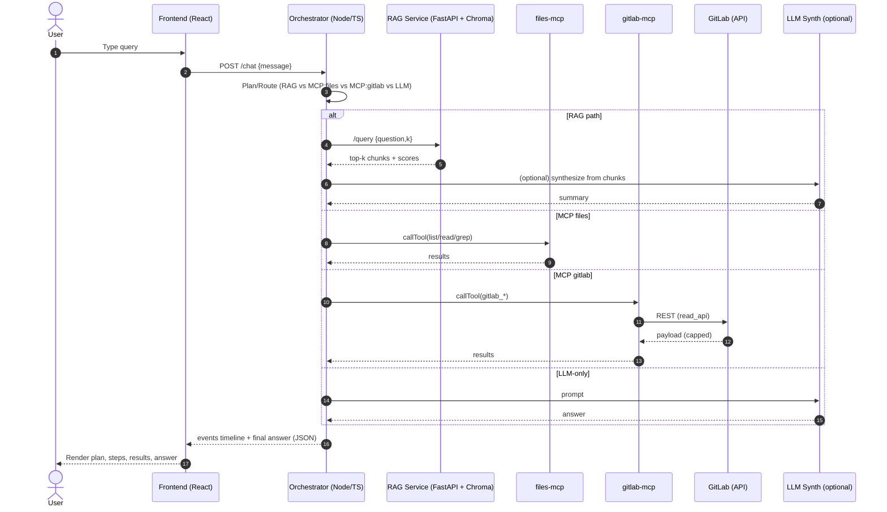

# Agentic RAG (Enterprise) — Architecture (Mermaid)

Below are Mermaid diagrams you can paste into your slides/README or preview in VS Code (Markdown Preview Mermaid Support) or mermaid.live.

---

## 1) System Architecture (Component View)

```mermaid
flowchart LR
  %% Style
  classDef svc fill:#1e293b,stroke:#334155,color:#e6edf3,rx:6,ry:6;
  classDef ext fill:#0b0f16,stroke:#334155,color:#cbd5e1,rx:6,ry:6,stroke-dasharray: 3 3;
  classDef db fill:#0f172a,stroke:#22d3ee,color:#e6edf3,rx:6,ry:6;

  U[User]:::ext --> FE[Frontend (React/Vite)]:::svc
  FE -->|/chat| ORCH[Orchestrator (Node/TS)]:::svc

  subgraph ROUTER[Planner / Router]
    ORCH
  end

  %% Paths
  ORCH -->|LLM-only| LLM[(LLM Synth / OpenAI Optional)]:::ext

  ORCH -->|RAG path| RAGAPI[FastAPI RAG Service]:::svc
  RAGAPI -->|embeddings| ST[Sentence-Transformers]:::ext
  RAGAPI <-->|similarity search| CHROMA[(Chroma Vector DB)]:::db

  ORCH -->|MCP (files)| MCPF[files-mcp server]:::svc
  ORCH -->|MCP (gitlab)| MCPG[gitlab-mcp server]:::svc

  MCPG -->|GitLab API| GL[(In-house GitLab)]:::ext

  %% Responses
  LLM --> ORCH
  RAGAPI --> ORCH
  MCPF --> ORCH
  MCPG --> ORCH
  ORCH -->|events + final answer| FE
```

---

## 2) Request Routing (Sequence)



---

## 3) Security & Ops (Simple View)

```mermaid
flowchart TB
  classDef guard fill:#0b0f16,stroke:#ef4444,color:#fecaca,rx:6,ry:6,stroke-width:2;
  classDef ob fill:#0b0f16,stroke:#22c55e,color:#d1fae5,rx:6,ry:6,stroke-width:2;

  subgraph MCP[mcp servers]
    G[mcp-gitlab\n- read_api token\n- ALLOWED_PROJECTS allowlist]:::guard
    F[files-mcp\n- path allowlist\n- output cap]:::guard
  end
  subgraph RAG[RAG service]
    E[Embeddings cache\n(model prefetch at build)]:::ob
    C[Chroma persist volume]:::ob
  end
  L[Logs/Audit\n(tool calls, args hash, status)]:::ob

  G --> L
  F --> L
  E --> C
```

---

### Notes
- The orchestrator **spawns MCP servers via stdio** (`mcp-use`) and inherits env vars — no open ports needed.
- **GitLab** access is **read-only** with **allowlisted projects**; responses are **truncated** to prevent payload bloat.
- **Chroma** is persisted via a Docker volume; embeddings are computed with **Sentence‑Transformers** at build time to avoid cold starts.
